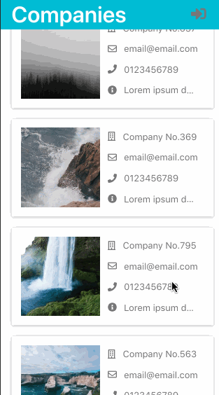
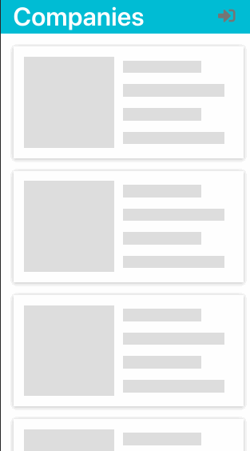
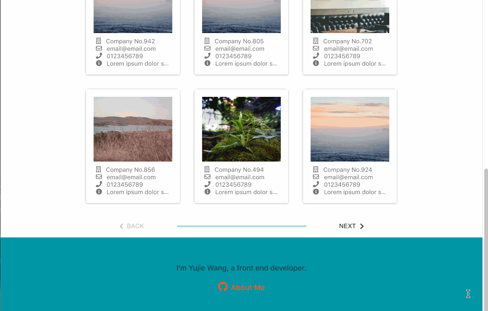

# About

It is a responsive designed demo app to fetch and show companies information.

**update**

Refactored the app using Redux.

~~version 1: React + Express~~

version 2: React/Redux + Express

# Features

* request list data (companies information) from the server
* responsive designed, flex layout
* different interaction for different device
  * mobile: click a button to load the next page, similar to infinite scroll 
  * web: use progress stepper to show paged data
    * only send the request to fetch data from API when necessary
* show loading indicator using React Hooks
* use material palette, customed material-ui and font awesome

# GIF Demonstration

**mobile**

**slow net speed**

**web**

